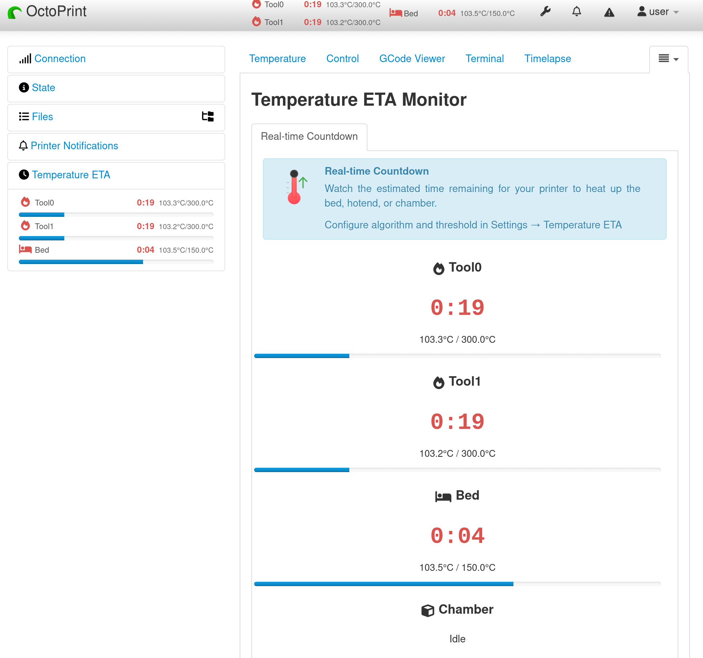
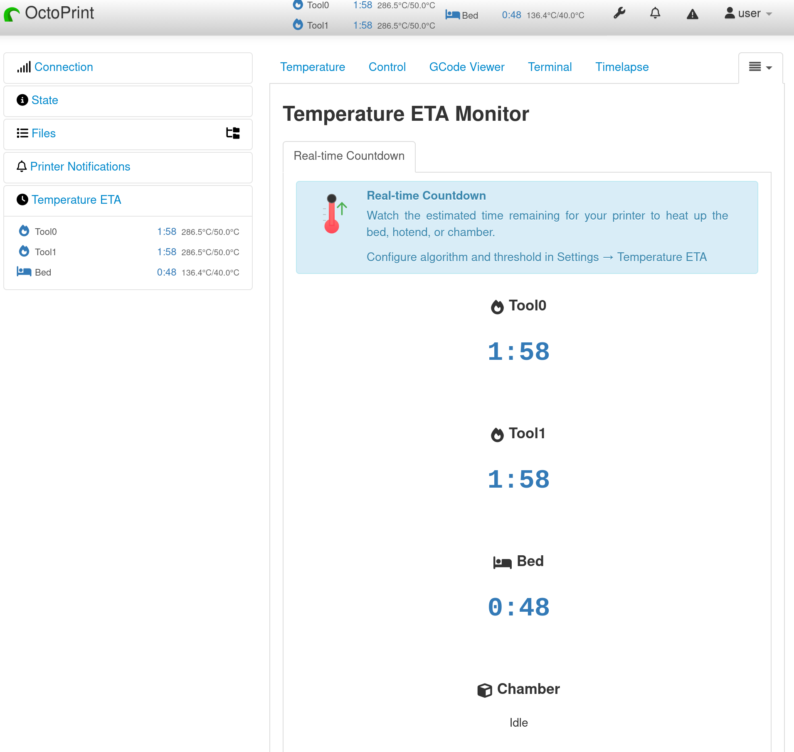
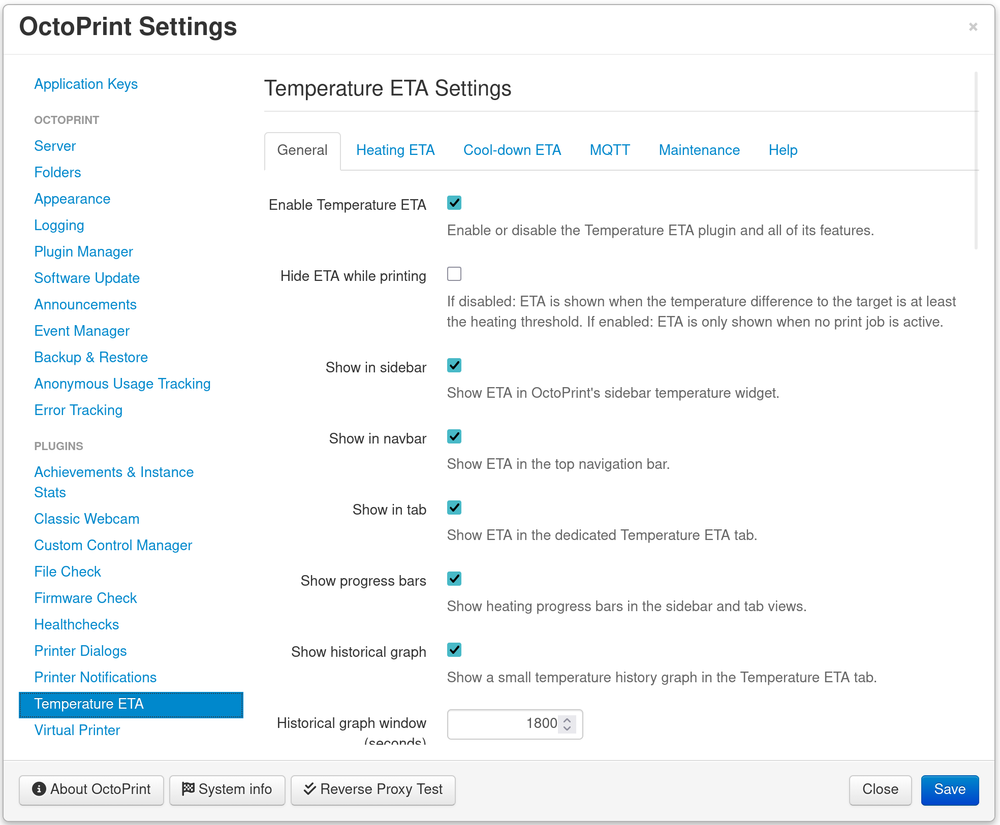

<!-- markdownlint-disable MD041 MD033-->
<p align="center">
  
</p>
<h1 align="center">OctoPrint Temperature ETA Plugin</h1>
<!-- markdownlint-enable MD041 MD033-->

[](https://www.gnu.org/licenses/agpl-3.0.html)
[](https://python.org)
[](https://octoprint.org)
[](https://github.com/Ajimaru/OctoPrint-TempETA/releases/latest)
[](https://github.com/Ajimaru/OctoPrint-TempETA/releases/latest)
[](https://github.com/Ajimaru/OctoPrint-TempETA/issues)
[](https://pre-commit.com/)
[](https://codecov.io/gh/Ajimaru/OctoPrint-TempETA)
[](https://github.com/Ajimaru/OctoPrint-TempETA/actions/workflows/ci.yml?query=branch%3Amain)
[](https://github.com/Ajimaru/OctoPrint-TempETA/actions/workflows/i18n.yml?query=branch%3Amain)
[](https://github.com/psf/black)
[](https://github.com/Ajimaru/OctoPrint-TempETA/pulls)

### Heat Up and Cool Down with Confidence

<!-- markdownlint-disable MD033-->
<strong>
  Display real-time countdown/ETA when your 3D printer's bed, hotend, or chamber is heating up or cooling down.<br />
  No more guessing how long until your print starts or is ready for maintenance!
</strong>

#### Heating



#### Cooling


<!-- markdownlint-enable MD033-->

## Features

- ⏱️ **Real-time ETA countdown** for bed, hotend and chamber heating or cooling
- 🌡️ **Smart calculation algorithms**: Linear (default) and exponential models
- 📊 **Flexible display**: Show ETA in navbar, sidebar, and/or a dedicated tab
- 📈 **Progress bars** (optional): Show progress to target in the sidebar and tab views
- 📉 **Historical temperature graphs**: A dedicated history view in the tab with a configurable time window
- ⏳ **Heating ETA**: Estimates time remaining until target temperature is reached
- 🧊 **Cool-down ETA**: Estimates time remaining until cool-down target is reached (target set to 0), with two modes: threshold-based and ambient-based
- 🎛️ **Configurable thresholds**: Start countdown when within a configurable delta to target
- 🎨 **Status colors**: Optional color bands for heating/cooling/idle states
- 🔔 **Sound alerts** (optional): Play a sound when target is reached or cool-down finishes
- 🖥️ **Browser toast notifications** (optional): Small top-right notifications for key events (default off)
- 🔁 **Reset history**: One-click reset deletes persisted history files for all printer profiles
- 🧰 **Multiple heaters**: Supports tools, bed and chamber (as reported by OctoPrint/printer)
- 🌍 **Internationalization**: English and German included, easily extensible
- 🧮 **Supports °C and °F** based on OctoPrint settings
- ⚙️ **Highly configurable**: Many settings to tailor behavior and display to your needs
- 🚀 **Lightweight**: Minimal performance impact (~2Hz monitoring)

## Installation

### Via Plugin Manager (Recommended)

1. Open OctoPrint web interface
2. Navigate to **Settings** → **Plugin Manager**
3. Click **Get More...**
4. Click **Install from URL** and enter:
   `https://github.com/Ajimaru/OctoPrint-TempETA/releases/latest/download/octoprint_tempeta-latest.zip`
5. Click **Install**
6. Restart OctoPrint

### Manual Installation

```bash
pip install https://github.com/Ajimaru/OctoPrint-TempETA/releases/latest/download/octoprint_tempeta-latest.zip
```

The `releases/latest` URL always points to the newest stable release.

## Configuration

After installation, configure the plugin in **Settings** → **Temperature ETA**:

<!-- markdownlint-disable MD033 -->

<!-- markdownlint-enable MD033 -->

The settings UI is organized into multiple tabs:

### General

- **Enable Temperature ETA**: Master switch for the plugin
- **Hide ETA while printing**: Optionally suppress ETA during active print jobs
- **Show in sidebar / navbar / tab**: Independently enable the UI placements
- **Show progress bars**: Show progress bars in sidebar and tab
- **Show historical graph** + **Historical graph window (seconds)**: Configure the history graph in the tab
- **Temperature display**: Use OctoPrint's preference or override it
- **Status colors**: Configure time-based bands or fixed status colors (heating/cooling/idle)
- **Update interval / history size**: Control frontend refresh rate and retained samples
- **Debug logging** (optional): Enables additional log output (may be noisy)
- **Sound alerts** (optional): Enable per-event sounds, volume, rate limit, and a test button
- **Browser notifications** (optional): Enable per-event toasts, timeout, and rate limit

### Heating ETA

- **Enable heating ETA**: Controls whether heating ETAs are shown/calculated
- **Heating threshold** + **Threshold unit**: Start ETA when within a configured delta to the target
- **Calculation algorithm**: Linear (default) or exponential

### Cool-down ETA

- **Enable cool-down ETA**: Turn cool-down ETA on/off
- **Mode**:
  - **Threshold target (default)**: Estimate time until a fixed, per-heater target is reached
  - **Ambient-based target**: Estimate time until near ambient temperature (best-effort)
- **Cool-down targets**: Configure per-heater targets (tool0/bed/chamber) for threshold mode
- **Ambient temperature** (optional): Provide a fixed ambient value for ambient mode
- **Hysteresis / fit window**: Controls when cool-down ETA disappears and how much recent data is used

### Maintenance

- **Reset profile history**: Deletes all persisted ETA history JSON files for all printer profiles (stored in OctoPrint's plugin data folder)
- **Restore defaults**: Resets only this plugin's settings back to defaults (does not delete history files)

### Help

- Quick explanations for the ETA logic and algorithms

### Settings Defaults

The following defaults apply to the user-editable plugin settings:

| Setting                   | Key                               | Default     |
| ------------------------- | --------------------------------- | ----------- |
| Enable Temperature ETA    | `enabled`                         | `true`      |
| Enable heating ETA        | `enable_heating_eta`              | `true`      |
| Hide ETA while printing   | `suppress_while_printing`         | `false`     |
| Show in sidebar           | `show_in_sidebar`                 | `true`      |
| Show in navbar            | `show_in_navbar`                  | `true`      |
| Show in tab               | `show_in_tab`                     | `true`      |
| Show progress bars        | `show_progress_bars`              | `true`      |
| Show historical graph     | `show_historical_graph`           | `true`      |
| Graph window (seconds)    | `historical_graph_window_seconds` | `180`       |
| Temperature display       | `temp_display`                    | `octoprint` |
| Heating threshold         | `threshold_start`                 | `5.0 °C`    |
| Threshold unit            | `threshold_unit`                  | `octoprint` |
| Algorithm                 | `algorithm`                       | `linear`    |
| Update Interval           | `update_interval`                 | `1.0 s`     |
| History Size              | `history_size`                    | `60`        |
| Enable cool-down ETA      | `enable_cooldown_eta`             | `true`      |
| Cool-down mode            | `cooldown_mode`                   | `threshold` |
| Enable debug logging      | `debug_logging`                   | `false`     |
| Color mode                | `color_mode`                      | `bands`     |
| Heating color             | `color_heating`                   | `#5cb85c`   |
| Cooling color             | `color_cooling`                   | `#337ab7`   |
| Idle color                | `color_idle`                      | `#777777`   |
| Enable sound alerts       | `sound_enabled`                   | `false`     |
| Sound: target reached     | `sound_target_reached`            | `false`     |
| Sound: cool-down done     | `sound_cooldown_finished`         | `false`     |
| Sound volume              | `sound_volume`                    | `0.5`       |
| Sound min interval        | `sound_min_interval_s`            | `10.0 s`    |
| Enable notifications      | `notification_enabled`            | `false`     |
| Notify: target reached    | `notification_target_reached`     | `false`     |
| Notify: cool-down done    | `notification_cooldown_finished`  | `false`     |
| Notification timeout      | `notification_timeout_s`          | `6.0 s`     |
| Notification min interval | `notification_min_interval_s`     | `10.0 s`    |

## How It Works

1. **Temperature Monitoring**: Plugin registers for temperature callbacks (~2Hz frequency)
2. **Rate Calculation**: Analyzes temperature history to determine heating rate (°C/second)
3. **ETA Estimation**: Uses selected algorithm (linear/exponential) to predict time to target
4. **Display Update**: Sends countdown to frontend via WebSocket (1Hz default)
5. **Smart Thresholds**: Only shows ETA when heating or cooling and within configured threshold

## FAQ

**Q: Why does the ETA jump around?**
A: Temperature changes aren't perfectly linear. The plugin uses recent data to calculate rate. Longer threshold values provide more stable estimates.

**Q: Can I use this with multiple hotends?**
A: Yes. The UI registers heaters dynamically as OctoPrint reports them (e.g. tool0, tool1, ...).

**Q: Does this work with chamber heaters?**
A: Yes! Enable chamber in settings if your printer has a chamber heater.

**Q: Will this slow down my prints?**
A: No. The plugin uses efficient algorithms and runs in a separate thread. Impact is negligible.

**Q: Can I hide the ETA during an active print?**
A: Yes. If you enable "Hide ETA while printing", the plugin will only show ETA when no print job is active. If the option is disabled (default), ETA is shown whenever the target temperature is at least the configured heating threshold above the current temperature.

## Contributing

Contributions welcome! Please:

1. Fork the repository
2. Create a feature branch: `git checkout -b wip/my-feature`
3. Write tests for new features
4. Submit a pull request
5. For local development scripts (setup, restart helper, post-commit build hook), see [.development/README.md](.development/README.md).
6. See [CONTRIBUTING.md](CONTRIBUTING.md) for detailed guidelines.
7. Please follow our [Code of Conduct](CODE_OF_CONDUCT.md).

Note: `main` is protected on GitHub, so changes go through PRs.

## License

AGPLv3 - See [LICENSE](LICENSE) for details.

## Support

- 🐛 **Bug Reports**: [GitHub Issues](https://github.com/Ajimaru/OctoPrint-TempETA/issues)
- 💬 **Discussion**: [OctoPrint Community Forum](https://community.octoprint.org/)

Note: For logs and troubleshooting, enable "debug logging" in the plugin settings.

## Credits

- **Original Request**: [Issue #469](https://github.com/OctoPrint/OctoPrint/issues/469) by [@CptanPanic](https://github.com/CptanPanic) (2014)
- **Development**: Built following [OctoPrint Plugin Guidelines](https://docs.octoprint.org/en/latest/plugins/index.html)
- **Contributors**: See [AUTHORS.md](AUTHORS.md)

---

**Like this plugin?** ⭐ Star the repo and share it with the OctoPrint community!
