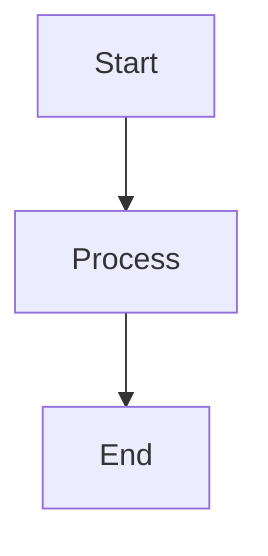

# OctoPrint-TempETA Documentation

This directory contains the source files for the [OctoPrint-TempETA developer documentation](https://ajimaru.github.io/OctoPrint-TempETA/).

## Quick Start

### Prerequisites

- Python 3.11+
- Node.js 20+

### Setup

```bash
# Install Python dependencies
pip install -r requirements-docs.txt

# Install Node.js dependencies
npm install
```

### Build & Serve

```bash
# Generate JavaScript API docs
./scripts/generate-jsdocs.sh

# Serve locally (with live reload)
mkdocs serve
# Open http://localhost:8000

# Build static site
mkdocs build
# Output in site/
```

## Documentation Structure

```
docs/
├── index.md                          # Overview
├── getting-started.md                # Development setup
├── architecture/                     # System design
│   ├── overview.md                   # Architecture overview
│   ├── data-flow.md                  # Data flow diagrams
│   ├── algorithms.md                 # ETA algorithms
│   ├── settings.md                   # Settings reference
│   └── octoprint-integration.md      # Plugin integration
├── api/                              # API reference
│   ├── python.md                     # Python API (auto-generated)
│   └── javascript.md                 # JavaScript API (auto-generated)
├── frontend/                         # Frontend docs
│   ├── ui-placements.md             # UI integration
│   └── i18n.md                      # Internationalization
├── development/                      # Developer guides
│   ├── contributing.md              # Contributing guide
│   ├── testing.md                   # Testing guide
│   └── release-process.md           # Release process
└── reference/                        # Reference docs
    ├── configuration.md             # Configuration reference
    └── cli-dev-scripts.md           # Dev scripts reference
```

## Technology Stack

- **[MkDocs](https://www.mkdocs.org/)** - Static site generator
- **[Material for MkDocs](https://squidfunk.github.io/mkdocs-material/)** - Material Design theme
- **[mkdocstrings](https://mkdocstrings.github.io/)** - Python API documentation
- **[jsdoc-to-markdown](https://github.com/jsdoc2md/jsdoc-to-markdown)** - JavaScript API documentation

## Auto-generation

### Python API

Python API documentation is automatically generated from docstrings using mkdocstrings.

To update:
1. Add/update docstrings in Python files
2. Run `mkdocs build`

### JavaScript API

JavaScript API documentation is generated from JSDoc comments.

To update:
1. Add JSDoc comments to JavaScript files
2. Run `./scripts/generate-jsdocs.sh`
3. Run `mkdocs build`

Example JSDoc comment:
```javascript
/**
 * Calculate ETA for a heater.
 * @param {string} heater - Heater name
 * @param {Object} data - Temperature data
 * @returns {number} ETA in seconds
 */
function calculateETA(heater, data) {
    // Implementation
}
```

## Deployment

Documentation is automatically deployed to GitHub Pages on push to `main` branch.

Workflow: `.github/workflows/docs.yml`

## Configuration

### mkdocs.yml

Main configuration file for MkDocs:
- Theme settings
- Navigation structure
- Plugin configuration
- Markdown extensions

### jsdoc.json

Configuration for JavaScript documentation:
- Source file patterns
- Output format
- Plugins

## Writing Documentation

### Style Guide

- Use Markdown for all documentation
- Include code examples where appropriate
- Add diagrams using Mermaid for complex flows
- Link between related pages
- Keep language clear and concise

### Markdown Extensions

Available extensions:
- **Admonitions**: `!!! note "Title"`
- **Code blocks**: ` ```python ` with syntax highlighting
- **Tables**: Standard Markdown tables
- **Mermaid diagrams**: ` ```mermaid `
- **Tabbed content**: Custom tabs

### Example: Admonition

```markdown
!!! warning "Important"
    This is a warning message.

!!! note
    This is a note without a title.
```

### Example: Mermaid Diagram

````markdown

````

### Example: Code Block

````markdown
```python
def example():
    """Example function."""
    return "Hello, World!"
```
````

## Local Development

### Watch Mode

MkDocs automatically rebuilds on file changes:

```bash
mkdocs serve
```

### Build Only

```bash
mkdocs build
```

### Clean Build

```bash
rm -rf site/
mkdocs build
```

## Troubleshooting

### "Module not found" errors

```bash
pip install -r requirements-docs.txt
```

### "npx: command not found"

```bash
npm install
```

### JavaScript docs empty

The JavaScript source files need JSDoc comments. See "Auto-generation" section above.

### Build warnings

Some warnings are expected (e.g., missing type annotations). These don't prevent the build.

### Port already in use

```bash
mkdocs serve -a localhost:8001
```

## Contributing

1. Make changes to documentation files
2. Test locally with `mkdocs serve`
3. Commit and push
4. GitHub Actions will automatically deploy

## Resources

- [MkDocs Documentation](https://www.mkdocs.org/)
- [Material for MkDocs](https://squidfunk.github.io/mkdocs-material/)
- [mkdocstrings Guide](https://mkdocstrings.github.io/)
- [Mermaid Syntax](https://mermaid.js.org/syntax/flowchart.html)

## License

Documentation is part of OctoPrint-TempETA and licensed under AGPLv3.
