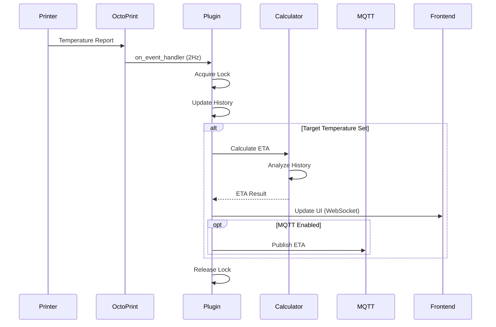
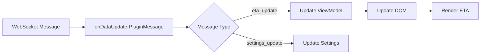
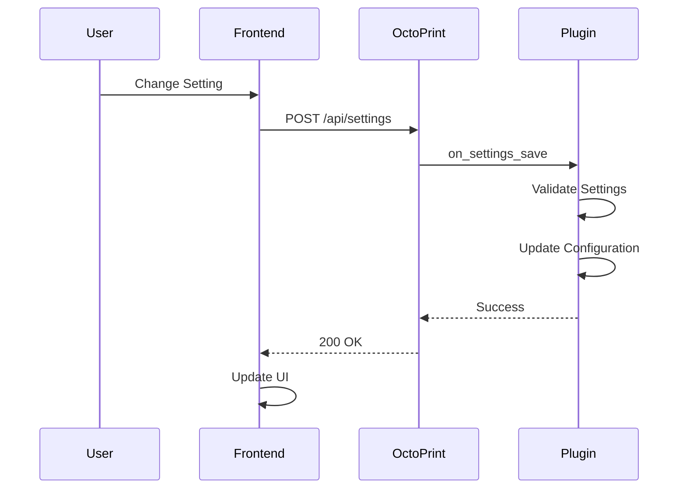

# Data Flow

This page describes how data flows through the OctoPrint-TempETA plugin.

## Temperature Update Flow



## Data Structures

### Temperature History

Each heater maintains a rolling history of temperature readings:

```python
history = deque(maxlen=max_samples)
# Each entry: (timestamp, temperature, target)
history.append((time.time(), current_temp, target_temp))
```

### ETA State

The plugin tracks ETA state for each heater:

```python
eta_state = {
    'tool0': {
        'current': 25.0,
        'target': 200.0,
        'eta_seconds': 120,
        'rate': 1.5,  # °C/s
        'direction': 'heating'
    },
    'bed': {
        # ... similar structure
    }
}
```

## Event Flow

### 1. Temperature Callback

Called approximately 2 times per second by OctoPrint:

```python
def on_event_handler(self, event, payload):
    if event == "CurrentTemperatureUpdated":
        self._process_temperature_update(payload)
```

### 2. History Update

New temperature reading is added to history:

```python
def _update_history(self, heater, temp_data):
    timestamp = time.time()
    current = temp_data.get("actual", 0)
    target = temp_data.get("target", 0)

    self._history[heater].append((timestamp, current, target))
    self._cleanup_old_data(heater)
```

### 3. ETA Calculation

If target is set, calculate ETA:

```python
def _calculate_eta(self, heater):
    history = self._history[heater]
    if len(history) < 2:
        return None

    if self._algorithm == "linear":
        return self._calculator.linear_eta(history)
    else:
        return self._calculator.exponential_eta(history)
```

### 4. Frontend Update

Send updated ETA to browser:

```python
def _send_update(self, heater, eta_data):
    self._plugin_manager.send_plugin_message(
        self._identifier,
        {
            "type": "eta_update",
            "heater": heater,
            "data": eta_data
        }
    )
```

### 5. MQTT Publish (Optional)

If MQTT is enabled, publish to topic:

```python
def _publish_mqtt(self, heater, eta_data):
    topic = f"octoprint/temp_eta/{heater}"
    payload = json.dumps(eta_data)
    self._mqtt_client.publish(topic, payload)
```

## Frontend Data Flow



### JavaScript Processing

```javascript
self.onDataUpdaterPluginMessage = function(plugin, data) {
    if (plugin !== "temp_eta") return;

    if (data.type === "eta_update") {
        self.updateETA(data.heater, data.data);
    }
};

self.updateETA = function(heater, data) {
    var obs = self.heaters[heater];
    if (obs) {
        obs.eta(data.eta_seconds);
        obs.rate(data.rate);
    }
};
```

## Settings Flow



## MQTT Message Format

### Temperature ETA Message

```json
{
  "heater": "tool0",
  "current": 25.0,
  "target": 200.0,
  "eta_seconds": 120,
  "eta_formatted": "02:00",
  "rate": 1.5,
  "direction": "heating",
  "timestamp": 1704751200
}
```

### Topic Structure

```
octoprint/temp_eta/tool0
octoprint/temp_eta/bed
octoprint/temp_eta/chamber
```

## Performance Optimization

### Throttling

Frontend updates are throttled to reduce load:

```javascript
self.throttledUpdate = _.throttle(function(data) {
    self.realUpdate(data);
}, self.settings.update_interval() * 1000);
```

### History Cleanup

Old data is automatically removed:

```python
def _cleanup_old_data(self, heater):
    cutoff = time.time() - self.MAX_HISTORY_AGE
    history = self._history[heater]

    while history and history[0][0] < cutoff:
        history.popleft()
```

### Lazy Calculation

ETA is only calculated when:

- Target temperature is set (> 0)
- Current temperature differs from target
- Sufficient history exists (≥2 samples)

## Error Handling

### Invalid Data

```python
def _validate_temp_data(self, data):
    try:
        temp = float(data.get("actual", 0))
        target = float(data.get("target", 0))
        return True
    except (ValueError, TypeError):
        self._logger.warning("Invalid temperature data")
        return False
```

### Calculation Failures

```python
try:
    eta = self._calculate_eta(heater)
except Exception as e:
    self._logger.error(f"ETA calculation failed: {e}")
    eta = None
```

### MQTT Failures

```python
try:
    self._mqtt_client.publish(topic, payload)
except Exception as e:
    self._logger.warning(f"MQTT publish failed: {e}")
    # Continue without MQTT
```

## Data Lifecycle

### Initialization

```python
def on_after_startup(self):
    self._history = {
        'tool0': deque(maxlen=self.MAX_SAMPLES),
        'bed': deque(maxlen=self.MAX_SAMPLES),
        'chamber': deque(maxlen=self.MAX_SAMPLES)
    }
```

### Shutdown

```python
def on_shutdown(self):
    if self._mqtt_client:
        self._mqtt_client.disconnect()

    # History is automatically cleared (no persistence)
```

## Thread Safety

All data access is protected by locks:

```python
self._lock = threading.RLock()

def _thread_safe_operation(self):
    with self._lock:
        # Access shared data
        history = self._history['tool0']
        # ... process
```

## Next Steps

- [Algorithms](algorithms.md) - ETA calculation implementation
- [Settings](settings.md) - Configuration options
- [Python API](../api/python.md) - Backend API reference
- [JavaScript API](../api/javascript.md) - Frontend API reference
