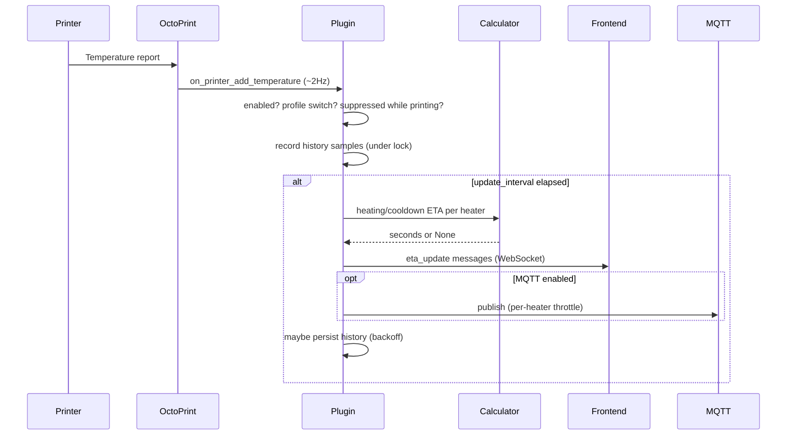
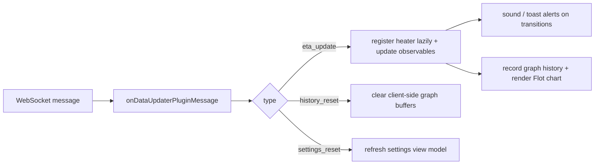

# Data Flow

This page describes how data flows through the OctoPrint-TempETA plugin.
The entry point is `on_printer_add_temperature` in
`octoprint_temp_eta/__init__.py` — the plugin registers itself as an
`octoprint.printer.PrinterCallback` (see
[OctoPrint Integration](octoprint-integration.md)).

## Temperature Update Flow


```mermaid
sequenceDiagram
    participant Printer
    participant OctoPrint
    participant Plugin
    participant Calculator
    participant Frontend
    participant MQTT

    Printer->>OctoPrint: Temperature report
    OctoPrint->>Plugin: on_printer_add_temperature (~2Hz)

    Plugin->>Plugin: enabled? profile switch? suppressed while printing?
    Plugin->>Plugin: record history samples (under lock)

    alt update_interval elapsed
        Plugin->>Calculator: heating/cooldown ETA per heater
        Calculator-->>Plugin: seconds or None
        Plugin->>Frontend: eta_update messages (WebSocket)
        opt MQTT enabled
            Plugin->>MQTT: publish (per-heater throttle)
        end
        Plugin->>Plugin: maybe persist history (backoff)
    end
```

## Step by step

### 1. Guards

Each callback first checks, in order:

- `enabled` setting — disabled means nothing is recorded or sent.
- **Profile switch** — if the active printer profile changed, the previous
  profile's history is persisted and the in-memory history replaced (empty on
  runtime switches; restored from disk on startup).
- **Suppression** — with `suppress_while_printing` enabled and a print job
  active, ETAs are cleared once and the callback returns until the job ends.

### 2. History recording (under `self._lock`)

For every heater entry in the callback data (any `Mapping`, so frozendict
printer state works too):

- **Active target** (`target > 0`): a `(timestamp, actual, target)` sample is
  appended to the heating history — but only while the heater is more than
  `threshold_start` below target and not merely holding (±0.2 °C). This keeps
  the fit window full of actual ramp data.
- **Target off** (`target <= 0`): a `(timestamp, actual)` sample goes to the
  separate **cooldown history**. On the heating→off transition that history
  is cleared first, so the cooling fit never sees pre-heat samples. While
  off, the plugin also learns a per-heater ambient baseline (lowest observed
  temperature) for ambient-mode cooldown.

Both histories are bounded deques (`history_size` samples).

### 3. Update gate

A shared cadence gate (checked atomically) allows one broadcast round per
`update_interval` seconds — concurrent callbacks can't double-broadcast.

### 4. ETA calculation and broadcast

`_calculate_and_broadcast_eta` builds one payload per profile-supported
heater (see [Algorithms](algorithms.md) for the math):

- heating: `calculate_linear_eta` or `calculate_exponential_eta` per the
  `algorithm` setting, only when `target - actual >= threshold_start`
- cooling: threshold or ambient mode via the cooldown estimators
- ETAs under 1 s are suppressed

Payloads are built under the lock but **sent outside it** to keep the
critical section small:

```python
{
    "type": "eta_update",
    "heater": "tool0",
    "eta": 120.0,            # seconds, or None (clears the countdown)
    "eta_kind": "heating",   # "heating" | "cooling" | None
    "target": 200.0,
    "actual": 25.0,
    "cooldown_target": None,
    "cooldown_mode": None,   # "threshold" | "ambient" | None
}
```

Updates are always sent — a `None` ETA tells the frontend to clear stale
countdowns.

### 5. MQTT publish (optional)

Each payload is also handed to the `MQTTClientWrapper`, which applies its own
**per-heater** `mqtt_publish_interval` throttle, detects state transitions
(`heating` / `cooling` / `at_target` / `cooled_down`) and publishes to:

```text
{active_topic}/{heater}/eta
{active_topic}/{heater}/state_change   (only on transitions)
```

See the README for the exact JSON payload formats.

### 6. History persistence

The heating history is persisted per printer profile to
`history_<profile>.json` in the plugin's data folder, so a restart during a
long heat-up doesn't lose the fit data:

- Writes are scheduled with **exponential backoff** (`persist_backoff_*`
  settings: first write after 60 s, doubling to a 300 s cap) to protect SD
  cards; phase transitions (heat start/end, target change, disconnect) reset
  the schedule.
- Writes are atomic (tmp file + `replace`) and size-capped
  (`persist_max_json_bytes`, oldest samples trimmed first).
- A dirty flag plus epoch counter ensures a persist never clears the dirty
  state of samples that arrived mid-write.
- On load, samples older than 180 s are discarded — the estimators only need
  the recent window anyway.

On `Disconnected` / `Error` / `Shutdown` events the current history is
persisted, then in-memory histories and frontend ETAs are cleared.

## Frontend Data Flow


```mermaid
graph LR
    A[WebSocket message] --> B[onDataUpdaterPluginMessage]
    B --> C{type}
    C -->|eta_update| D[register heater lazily + update observables]
    C -->|history_reset| E[clear client-side graph buffers]
    C -->|settings_reset| F[refresh settings view model]
    D --> G[sound / toast alerts on transitions]
    D --> H[record graph history + render Flot chart]
```

Heaters are registered dynamically the first time a message mentions them —
nothing is hard-coded to tool0/bed/chamber. Each heater gets Knockout
observables (`eta`, `etaKind`, `actual`, `target`, `cooldownTarget`,
`startTemp`, `startTarget`); observables are only written when the value
actually changed to avoid redundant re-renders. Progress bars derive their
percentage from the captured `startTemp → target` span.

The historical graph keeps its own client-side sample buffer (pruned to the
configured window with a moving start index instead of `shift()`), rendered
via OctoPrint's bundled Flot at most once per second per heater.

## Settings Flow

See [Settings Architecture](settings.md) for the full save/validate/apply
pipeline.

## Error Handling

The guiding rule is that the temperature callback must never raise into
OctoPrint's printer thread:

- Non-numeric `actual` values skip the sample; non-numeric `target` values
  (e.g. `"off"`) are treated as 0 (cooldown).
- Estimator-internal math errors degrade to the simpler estimator or `None`
  (see [Algorithms](algorithms.md)).
- MQTT publish failures are logged and dropped — the wrapper reconnects in
  the background with a 30 s retry interval.
- Persistence failures are logged at debug level and retried on the next
  scheduled persist.

## Thread Safety

OctoPrint may deliver callbacks from worker threads, so shared state is
guarded by dedicated `threading.Lock`s with strict nesting rules:

- `self._lock` — heating/cooldown histories and the active profile id.
- `self._persist_state_lock` — persistence backoff schedule and the update
  cadence gate; never held together with `self._lock`.
- `self._profile_switch_lock` — serializes the persist → id-swap →
  history-replace sequence on profile switches.
- `self._suppress_lock` — the one-shot "clear on suppression start" latch.

The MQTT wrapper has its own internal lock; message payloads are immutable
snapshots by the time they leave the plugin lock.

## Next Steps

- [Algorithms](algorithms.md) - ETA calculation implementation
- [Settings](settings.md) - Configuration options
- [Python API](../api/python.md) - Backend API reference
- [JavaScript API](../api/javascript.md) - Frontend API reference
