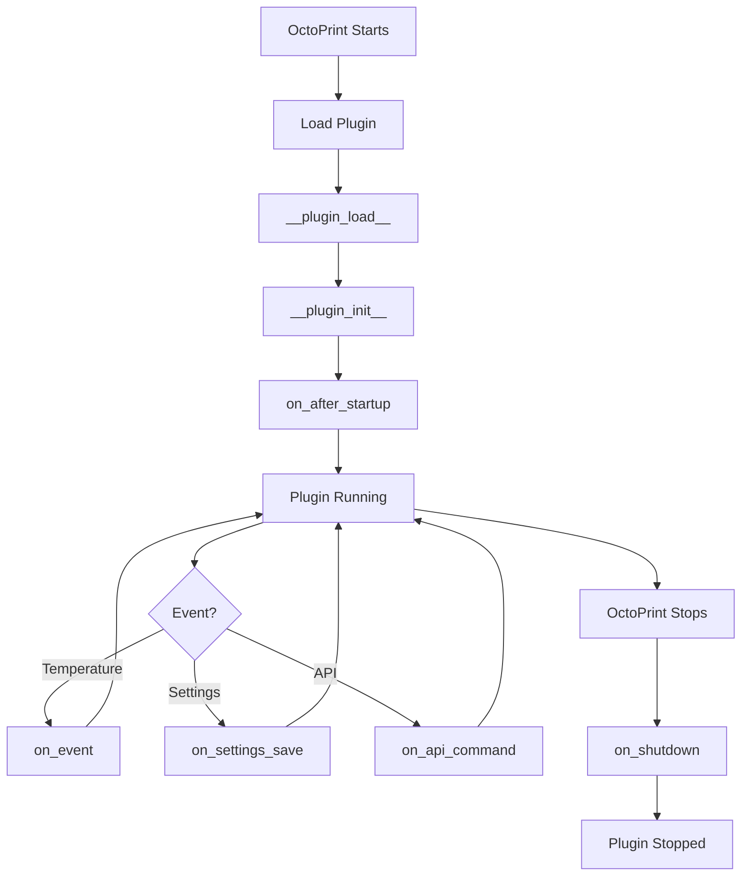

# OctoPrint Integration

This page describes how OctoPrint-TempETA integrates with OctoPrint's plugin framework.

## Plugin Mixins

The plugin implements multiple OctoPrint plugin mixins to integrate with different subsystems.

### StartupPlugin

Handles plugin initialization and cleanup.

```python
class TempETAPlugin(octoprint.plugin.StartupPlugin):
    def on_after_startup(self):
        """Called after OctoPrint has fully started."""
        self._logger.info("TempETA plugin started")
        self._initialize_history()
        self._start_mqtt_client()

    def on_shutdown(self):
        """Called when OctoPrint is shutting down."""
        self._logger.info("TempETA plugin shutting down")
        self._stop_mqtt_client()
```

**Use Cases:**
- Initialize data structures
- Start background services (MQTT)
- Register event handlers
- Clean up on shutdown

### TemplatePlugin

Provides custom UI templates.

```python
class TempETAPlugin(octoprint.plugin.TemplatePlugin):
    def get_template_configs(self):
        """Return template configurations."""
        return [
            {
                "type": "settings",
                "custom_bindings": True,
                "template": "temp_eta_settings.jinja2"
            },
            {
                "type": "sidebar",
                "custom_bindings": False,
                "template": "temp_eta_sidebar.jinja2",
                "icon": "clock-o"
            },
            {
                "type": "tab",
                "custom_bindings": True,
                "template": "temp_eta_tab.jinja2"
            }
        ]
```

**Template Types:**
- **settings**: Plugin settings page
- **sidebar**: Sidebar widget
- **tab**: Main content tab
- **navbar**: Navigation bar item

**Template Location:**
```
octoprint_temp_eta/templates/
├── temp_eta_settings.jinja2
├── temp_eta_sidebar.jinja2
└── temp_eta_tab.jinja2
```

### SettingsPlugin

Manages plugin configuration.

```python
class TempETAPlugin(octoprint.plugin.SettingsPlugin):
    def get_settings_defaults(self):
        """Return default settings."""
        return {
            "enabled": True,
            "algorithm": "linear",
            "update_interval": 1.0,
            "min_rate": 0.1,
            "max_eta": 3600,
            # ... more defaults
        }

    def on_settings_save(self, data):
        """Called when settings are saved."""
        # Validate settings
        self._validate_settings(data)

        # Save settings
        octoprint.plugin.SettingsPlugin.on_settings_save(self, data)

        # Apply changes
        self._apply_settings()

    def get_settings_version(self):
        """Return settings version for migration."""
        return 2

    def on_settings_migrate(self, target, current):
        """Migrate settings from old version."""
        if current == 1:
            # Migrate v1 to v2
            self._settings.set(["new_setting"], "default")
```

**Settings Access:**
```python
# Get setting
value = self._settings.get(["key"])

# Set setting
self._settings.set(["key"], value)

# Get with default
value = self._settings.get(["key"], merged=True)
```

### AssetPlugin

Serves static files (JavaScript, CSS, images).

```python
class TempETAPlugin(octoprint.plugin.AssetPlugin):
    def get_assets(self):
        """Return static assets."""
        return {
            "js": ["js/temp_eta.js"],
            "css": ["css/temp_eta.css"],
            "less": ["less/temp_eta.less"]
        }
```

**Asset Location:**
```
octoprint_temp_eta/static/
├── js/
│   └── temp_eta.js
├── css/
│   └── temp_eta.css
├── less/
│   └── temp_eta.less
├── img/
│   └── temp_eta.svg
└── sounds/
    └── heating_complete.mp3
```

**Asset URLs:**
```
/plugin/temp_eta/static/js/temp_eta.js
/plugin/temp_eta/static/css/temp_eta.css
```

### EventHandlerPlugin

Receives OctoPrint events.

```python
class TempETAPlugin(octoprint.plugin.EventHandlerPlugin):
    def on_event(self, event, payload):
        """Handle OctoPrint events."""
        if event == "PrintStarted":
            self._logger.info("Print started")
            self._reset_eta()

        elif event == "PrintDone":
            self._logger.info("Print completed")
            self._clear_eta()

        elif event == "CurrentTemperatureUpdated":
            self._on_temperature_update(payload)
```

**Key Events:**
- **CurrentTemperatureUpdated**: Temperature change (~2Hz)
- **PrintStarted**: Print job starts
- **PrintDone**: Print job completes
- **Disconnected**: Printer disconnects
- **Connected**: Printer connects

### SimpleApiPlugin

Provides REST API endpoints.

```python
class TempETAPlugin(octoprint.plugin.SimpleApiPlugin):
    def get_api_commands(self):
        """Return available API commands."""
        return {
            "get_eta": [],
            "reset": []
        }

    def on_api_command(self, command, data):
        """Handle API command."""
        if command == "get_eta":
            return flask.jsonify(self._get_current_eta())

        elif command == "reset":
            self._reset_history()
            return flask.jsonify({"success": True})

    def on_api_get(self, request):
        """Handle GET request."""
        return flask.jsonify({
            "eta": self._get_current_eta(),
            "settings": self._get_public_settings()
        })
```

**API Endpoints:**
```
GET  /api/plugin/temp_eta
POST /api/plugin/temp_eta
```

**Example Request:**
```bash
# Get ETA
curl http://octopi.local/api/plugin/temp_eta

# Reset history
curl -X POST \
  -H "X-Api-Key: YOUR_API_KEY" \
  -H "Content-Type: application/json" \
  -d '{"command": "reset"}' \
  http://octopi.local/api/plugin/temp_eta
```

## Plugin Lifecycle



## Plugin Registration

### `__init__.py` Structure

```python
# Module-level plugin interface
def __plugin_load__():
    """Load the plugin."""
    global __plugin_implementation__
    __plugin_implementation__ = TempETAPlugin()

    global __plugin_hooks__
    __plugin_hooks__ = {
        "octoprint.plugin.softwareupdate.check_config":
            __plugin_implementation__.get_update_information
    }

def __plugin_check__():
    """Check plugin requirements."""
    try:
        import paho.mqtt
    except ImportError:
        return False
    return True
```

### Plugin Metadata

```python
__plugin_name__ = "Temperature ETA"
__plugin_pythoncompat__ = ">=3.11,<4"
__plugin_version__ = "0.7.0"
__plugin_description__ = "Show ETA for printer heating/cooling"
__plugin_author__ = "Ajimaru"
__plugin_author_email__ = "ajimaru_gdr@pm.me"
__plugin_url__ = "https://github.com/Ajimaru/OctoPrint-TempETA"
__plugin_license__ = "AGPLv3"
```

## WebSocket Communication

### Send Message to Frontend

```python
self._plugin_manager.send_plugin_message(
    self._identifier,
    {
        "type": "eta_update",
        "heater": "tool0",
        "data": {
            "current": 25.0,
            "target": 200.0,
            "eta_seconds": 120
        }
    }
)
```

### Receive in Frontend

```javascript
self.onDataUpdaterPluginMessage = function(plugin, data) {
    if (plugin !== "temp_eta") return;

    if (data.type === "eta_update") {
        self.updateETA(data.heater, data.data);
    }
};
```

## Plugin Dependencies

### Required

```python
# In setup.py or pyproject.toml
install_requires = [
    "OctoPrint>=1.12.0",
    "paho-mqtt>=1.6.0,<3.0.0"
]
```

### Optional

Dependencies that enhance functionality but aren't required:

- numpy: For exponential algorithm
- scipy: For advanced fitting

## Plugin Hooks

### Software Update Hook

```python
def get_update_information(self):
    """Provide update information."""
    return {
        "temp_eta": {
            "displayName": "Temperature ETA",
            "displayVersion": self._plugin_version,

            "type": "github_release",
            "user": "Ajimaru",
            "repo": "OctoPrint-TempETA",
            "current": self._plugin_version,

            "pip": "https://github.com/Ajimaru/OctoPrint-TempETA/releases/latest/download/release.zip"
        }
    }
```

## Logging

Use OctoPrint's logging system:

```python
# Get logger
self._logger = logging.getLogger(__name__)

# Log levels
self._logger.debug("Debug message")
self._logger.info("Info message")
self._logger.warning("Warning message")
self._logger.error("Error message")
self._logger.exception("Exception with traceback")
```

**Configure in OctoPrint:**
```
Settings → Logging → Add logger
Logger: octoprint.plugins.temp_eta
Level: DEBUG
```

## Error Handling

### Graceful Degradation

```python
try:
    self._mqtt_client.connect()
except Exception as e:
    self._logger.warning(f"MQTT connection failed: {e}")
    self._mqtt_enabled = False
    # Plugin continues without MQTT
```

### User Notifications

```python
# Show notification in UI
self._plugin_manager.send_plugin_message(
    self._identifier,
    {
        "type": "notification",
        "level": "error",
        "title": "Temperature ETA Error",
        "message": "Failed to calculate ETA"
    }
)
```

## Testing with OctoPrint

### Development Setup

```bash
# Install OctoPrint
pip install "OctoPrint>=1.11.0,<2"

# Install plugin in dev mode
pip install -e .

# Run OctoPrint
octoprint serve --debug
```

### Mock Printer

Use OctoPrint's virtual printer for testing:

```
Settings → Serial Connection → Additional serial ports
Add: /dev/ttyFAKE

Connect to /dev/ttyFAKE
```

## Plugin Distribution

### PyPI Package

```bash
# Build package
python -m build

# Upload to PyPI
twine upload dist/*
```

### Plugin Repository

Submit to [OctoPrint Plugin Repository](https://plugins.octoprint.org/):

1. Create release on GitHub
2. Submit plugin via web form
3. Wait for review

## Best Practices

1. **Use OctoPrint's systems**: Don't reinvent logging, settings, etc.
2. **Handle errors gracefully**: Plugin failures shouldn't crash OctoPrint
3. **Respect threading**: Use locks for shared data
4. **Log appropriately**: Debug logs for development, info for users
5. **Document settings**: Provide clear descriptions
6. **Test thoroughly**: Test with virtual and real printers
7. **Follow conventions**: Use OctoPrint's coding style

## Next Steps

- [Plugin API Reference](../api/python.md) - Detailed API documentation
- [Settings Reference](settings.md) - All configuration options
- [Testing Guide](../development/testing.md) - How to test the plugin
