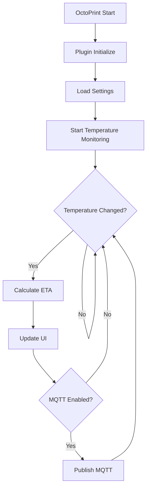

# Architecture Overview

OctoPrint-TempETA is designed as a lightweight, efficient OctoPrint plugin that monitors temperature changes and calculates estimated time to target temperature.

## System Components

The plugin consists of three main components:

### 1. Backend (Python)

- **Plugin Core** (`__init__.py`): Main plugin implementation using OctoPrint's plugin framework
- **Calculator** (`calculator.py`): Temperature ETA calculation algorithms
- **MQTT Client** (`mqtt_client.py`): Optional MQTT integration for external monitoring

### 2. Frontend (JavaScript)

- **View Model** (`temp_eta.js`): Knockout.js-based UI component
- Displays ETA countdowns in the navbar, sidebar and a dedicated tab
  (including per-heater history charts)
- Handles user interactions, alerts (sound/toast) and settings validation

### 3. Communication Layer

- **Plugin Events**: OctoPrint's event system for temperature updates
- **MQTT Messages**: Optional external integration
- **WebSocket**: Real-time updates to the frontend

## Design Principles

### Thread Safety

Temperature callbacks occur on separate threads (~2Hz). All shared data structures use thread locks to prevent race conditions.

```python
self._lock = threading.Lock()

def on_printer_add_temperature(self, data):
    ...
    with self._lock:
        # Safe access to the per-heater history deques
        self._temp_history[heater].append((now, actual, target))
```

See [Data Flow](data-flow.md#thread-safety) for the full set of locks and
their nesting rules.

### Performance

- **Callback Processing**: well under 10ms per invocation (pure Python, no numpy)
- **History Management**: bounded deques (`history_size`, default 60 samples per heater)
- **Memory Usage**: negligible — a few hundred small tuples
- **Frontend Updates**: configurable rate (`update_interval`, default 1Hz)

### Modularity

Each component is independent:

- Calculator can run standalone for testing
- MQTT client is optional
- Frontend can be customized without backend changes

## Plugin Lifecycle


```mermaid
graph TD
    A[OctoPrint Start] --> B[Plugin Initialize]
    B --> C[Load Settings]
    C --> D[Start Temperature Monitoring]
    D --> E{Temperature Changed?}
    E -->|Yes| F[Calculate ETA]
    E -->|No| E
    F --> G[Update UI]
    G --> H{MQTT Enabled?}
    H -->|Yes| I[Publish MQTT]
    H -->|No| E
    I --> E
```

## Data Flow

See [Data Flow](data-flow.md) for detailed information on how data moves through the system.

## Key Algorithms

The plugin uses two ETA calculation methods:

### Linear Algorithm (Default)

Simple and fast, assumes constant heating/cooling rate:

```text
rate = ΔT / Δt
ETA = (target - current) / rate
```

### Exponential Algorithm (Advanced)

Models thermal dynamics more accurately:

```text
T(t) = T_final - (T_final - T_0) * e^(-t/tau)
```

See [Algorithms](algorithms.md) for implementation details.

## OctoPrint Integration

The plugin implements OctoPrint's `PrinterCallback` (the temperature data
source) plus several plugin mixins:

- **PrinterCallback**: receives temperature updates (~2Hz)
- **StartupPlugin**: initialization (callback registration, history restore, MQTT)
- **TemplatePlugin**: UI integration (navbar, sidebar, tab, settings)
- **SettingsPlugin**: configuration management
- **AssetPlugin**: static file serving
- **EventHandlerPlugin**: connection/print-job lifecycle handling
- **SimpleApiPlugin**: REST API endpoints (status + maintenance commands)

See [OctoPrint Integration](octoprint-integration.md) for details.

## Configuration

Settings are stored in OctoPrint's configuration system:

```yaml
plugins:
  temp_eta:
    enabled: true
    algorithm: linear
    update_interval: 1.0
    threshold_start: 5.0
    # ... more settings
```

See the [Configuration Reference](../reference/configuration.md) for all
keys and [Settings Architecture](settings.md) for how they are applied.

## Internationalization

The plugin supports multiple languages using Flask-Babel:

- English (default)
- German

Translation workflow:

1. Extract messages: `pybabel extract`
2. Update catalogs: `pybabel update`
3. Compile: `pybabel compile`

See [Internationalization](../frontend/i18n.md) for details.

## Extension Points

Developers can extend the plugin through:

1. **Custom Algorithms**: Implement new calculation methods
2. **MQTT Topics**: Subscribe to published data
3. **Settings Overlays**: Add custom configuration
4. **UI Themes**: Customize appearance via CSS/LESS

## Dependencies

### Runtime

- Python 3.9+
- OctoPrint 1.10.2+
- paho-mqtt >=2.0.0,<3.0.0 (installed automatically; the MQTT publishing feature itself is opt-in via settings)

### Development

- pytest 7+
- pre-commit 3+
- black 24+
- isort 5+
- flake8 7+

### Documentation

- mkdocs
- mkdocs-material
- mkdocstrings
- mkdocstrings-python
- pymdown-extensions
- jsdoc (Node.js)
- jsdoc-to-markdown (Node.js)

## Security Considerations

- **No external API calls**: All processing is local
- **Input validation**: All settings are validated
- **Thread safety**: Proper locking for concurrent access
- **MQTT authentication**: Supports username/password and TLS
- **Template autoescape**: Enabled to prevent XSS

## Diagnostics

Enable the plugin's **Debug logging** setting for throttled diagnostic
output (callback statistics, persist scheduling, cooldown fit decisions,
settings snapshots) in `octoprint.log` — no logger reconfiguration needed.
For live resource monitoring of a development instance, see
`.development/monitor_octoprint_performance.sh`.

## Next Steps

- [Data Flow](data-flow.md) - How data moves through the system
- [Algorithms](algorithms.md) - ETA calculation methods
- [Settings](settings.md) - Configuration reference
- [OctoPrint Integration](octoprint-integration.md) - Plugin implementation details
